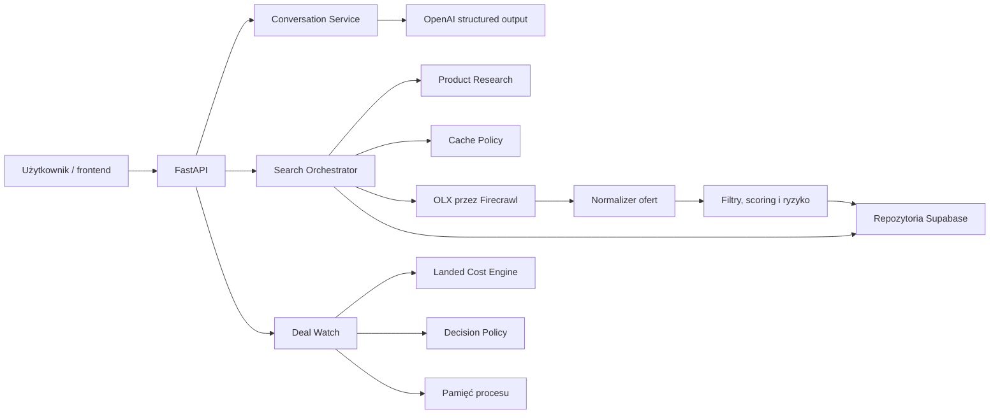

# Sigma Shopping Agent — kompletny opis projektu od fazy 0 do fazy 5

**Stan dokumentu:** 11 lipca 2026  
**Zakres:** backend demonstracyjnego agenta zakupowego dla używanych słuchawek  
**Technologie:** Python 3.12, FastAPI, Pydantic 2, OpenAI, Firecrawl, Supabase/PostgreSQL

## 1. Streszczenie projektu

Sigma Shopping Agent jest backendem agenta, który pomaga osobie bez specjalistycznej
wiedzy przejść od krótkiego opisu potrzeby do konkretnej, uzasadnionej decyzji zakupowej
na rynku używanej elektroniki. Demonstracyjna wersja skupia się na jednej kategorii:
używanych słuchawkach.

Użytkownik może rozpocząć rozmowę na dwa sposoby:

- opisać potrzebę, np. „Szukam dobrych słuchawek z ANC do 500 zł”;
- wskazać produkt referencyjny, np. „Chcę coś podobnego do AirPods Pro, ale taniej”.

System wydobywa wymagania, rozpoznaje produkt referencyjny, przedstawia 4–6 możliwych
modeli, a po wyborze kierunku pobiera i ocenia konkretne oferty. Wynik nie jest zwykłą
listą linków. Agent oddziela:

1. dopasowanie produktu do potrzeby;
2. jakość konkretnej oferty;
3. wiarygodność sprzedawcy;
4. poziom niepewności i braki danych.

Faza 5 rozszerza ten przepływ o deterministyczny tryb Deal Watch. Użytkownik definiuje
mandat obserwacji, a system oblicza pełny koszt zakupu i wydaje jedną z trzech decyzji:
`ignore`, `hold` albo `alert`. Tryb nie wykonuje płatności ani automatycznego zakupu.

## 2. Problem użytkownika

Rynek używanej elektroniki jest rozproszony i niejednorodny. Nazwy modeli bywają
nieprecyzyjne, różne generacje wyglądają podobnie, a pozornie niska cena może oznaczać
zły wariant, uszkodzenie, brak dostawy, niepełny zestaw lub niewiarygodnego sprzedawcę.
Osoba kupująca musi zwykle samodzielnie:

- ustalić, które modele rzeczywiście spełniają jej potrzeby;
- zrozumieć, co jest ważne w danej kategorii;
- porównać generacje, warianty i ceny;
- przejrzeć wiele ogłoszeń;
- ocenić stan, kompletność, gwarancję i możliwość zwrotu;
- rozpoznać brak danych, sygnały oszustwa i pozorne okazje;
- podjąć decyzję mimo niepewności.

Sigma redukuje ten wysiłek. Zamiast wymagać rozbudowanego formularza filtrów, przyjmuje
naturalną wypowiedź i prowadzi użytkownika przez ograniczony, zrozumiały proces.

## 3. Użytkownik docelowy i obietnica wartości

Produkt jest przeznaczony dla osoby, która chce kupić elektronikę możliwie tanio,
dopuszcza rynek wtórny, ale nie zna dobrze modeli i nie chce samodzielnie analizować
dziesiątek ofert.

Główna obietnica wartości brzmi:

> Powiedz, czego potrzebujesz albo co Ci się podoba. Agent znajdzie podobne, lepiej
> dopasowane produkty i wskaże używaną ofertę, którą warto rozważyć.

Wyróżnikiem jest połączenie trzech rozdzielonych zwykle zadań: researchu produktu,
wyszukania alternatyw oraz oceny konkretnej transakcji. System nie ukrywa niepewności.
Jeżeli źródło nie dostarcza informacji o baterii, autentyczności, gwarancji, zwrocie lub
sprzedawcy, pole pozostaje jawnie oznaczone jako `unknown` albo trafia do `data_gaps`.

## 4. Zakres i świadome ograniczenia

### Zakres wersji demonstracyjnej

- jedna kategoria: używane słuchawki;
- język polski i domyślna waluta PLN;
- wejście od potrzeby albo produktu referencyjnego;
- maksymalnie trzy pytania doprecyzowujące w sesji;
- 4–6 modeli na etapie eksploracji;
- cztery kierunki wyboru: `most_similar`, `best_quality`, `lowest_price`, `best_value`;
- pełne wyszukiwanie dopiero po wyborze produktu lub kierunku;
- normalizacja ofert z OLX pobieranych przez Firecrawl;
- deterministyczny ranking i jawne składowe oceny;
- cache, częściowy wynik i kontrolowana obsługa awarii;
- lokalny Deal Watch z pełnym kosztem i audytowalną decyzją.

### Poza zakresem

- konta użytkowników i trwała personalizacja między sesjami;
- Redis, Celery i produkcyjna kolejka zadań;
- automatyczny zakup, checkout i płatności;
- produkcyjny monitoring działający bez przerwy;
- wiele kategorii z osobnymi ontologiami cech;
- uczenie rankera na zachowaniu użytkowników;
- zaawansowane wykrywanie fałszywek;
- produkcyjna deduplikacja tej samej oferty między wieloma marketplace'ami.

## 5. Architektura systemu

Backend jest modularnym monolitem FastAPI. Jeden proces składa wyspecjalizowane moduły,
które komunikują się przez modele Pydantic i jawne protokoły.



Najważniejsze moduły:

- `app/conversation` — interpretuje rozmowę i aktualizuje wymagania;
- `app/product_research` — tworzy lub odczytuje brief produktu;
- `app/sources` — izoluje zewnętrzne źródła ofert;
- `app/listings` — normalizuje surowe rekordy;
- `app/ranking` — filtruje, punktuje i wyjaśnia wyniki;
- `app/repositories` — komunikuje się z Supabase;
- `app/orchestration` — steruje kolejnością, cache i obsługą błędów;
- `app/deal_watch` — oblicza pełny koszt i wydaje decyzje obserwacyjne;
- `app/api` — udostępnia cienkie endpointy HTTP;
- `app/bootstrap.py` — składa prawdziwe integracje z konfiguracji.

LLM odpowiada za interpretację języka i sformułowanie ustrukturyzowanego wyniku. Nie
decyduje o progach cache, twardych filtrach, wariancie ani końcowym wyniku punktowym.
Te elementy pozostają w deterministycznym kodzie.

## 6. Główny przepływ użytkownika

### Etap eksploracji

1. Klient tworzy sesję przez `POST /sessions`.
2. Wysyła wiadomość do `POST /sessions/{session_id}/messages`.
3. `ConversationService` łączy wiadomość z dotychczasowymi wymaganiami.
4. Odpowiedź OpenAI jest walidowana przez Pydantic.
5. Jeżeli brakuje krytycznej informacji, agent zadaje jedno pytanie. Łączny limit to
   trzy pytania w sesji.
6. Jeżeli danych wystarcza, agent zwraca 4–6 modeli z orientacyjną ceną, powodami
   podobieństwa, różnicami i głównym kompromisem.
7. Lista jest jawnie etapem eksploracji, a nie końcowym rankingiem ofert.

### Etap pełnego wyszukiwania

1. Użytkownik wybiera produkt i kierunek przez endpoint `select`.
2. Backend tworzy `search_run`, od razu zwraca `run_id` i uruchamia pracę w
   `BackgroundTasks`.
3. Orkiestrator równolegle przygotowuje brief produktu oraz sprawdza cache ofert.
4. Jeżeli cache jest niewystarczający, źródło Firecrawl pobiera wyniki OLX.
5. Normalizator wydobywa cenę, walutę, stan, wariant, lokalizację, dostawę, gwarancję,
   zwrot, sygnały sprzedawcy i braki danych.
6. Niezgodny dokładny wariant jest odrzucany przed scoringiem.
7. Oferty przechodzą twarde filtry i deterministyczny ranking.
8. Rekomendacje są zapisywane, a frontend odpytuje `GET /runs/{run_id}`.

### Zmiana preferencji

Zmiana miękka, np. większe znaczenie gwarancji, może wykonać `rerank` istniejących
danych. Zmiana wymagająca nowych pól lub pozostawiająca mniej niż pięć ofert uruchamia
`refetch`. Zmiana kategorii lub celu prowadzi do `new_product_research`.

## 7. Model domenowy i dane

Najważniejsze modele domenowe to:

- `Requirements` — budżet, waluta, twarde warianty i cechy, preferencje, dostawa,
  produkt referencyjny oraz kierunek wyszukiwania;
- `ReferenceProduct` — marka, model, dokładny wariant, źródło, pewność i braki;
- `SearchQuery` — parametry przekazywane adapterowi źródła;
- `RawListing` — surowa oferta po minimalnym mapowaniu adaptera;
- `NormalizedListing` — wspólny kontrakt oferty używany przez repozytorium i ranking;
- `ScoreBreakdown` i `RankedListing` — wynik, składowe, ryzyko oraz trzy osobne oceny;
- `DealMandate`, `MarketEvent`, `CostBreakdown`, `DealDecision` — kontrakty fazy 5.

Supabase przechowuje siedem głównych tabel:

| Tabela | Odpowiedzialność |
|---|---|
| `products` | Kanoniczne modele i specyfikacje produktów |
| `product_research` | Briefy zakupowe, źródła i wersje researchu |
| `listings` | Aktualny, znormalizowany stan ofert |
| `listing_snapshots` | Historia ceny i dostępności |
| `sessions` | Kontekst rozmowy i wybrany produkt |
| `search_runs` | Status pracy, zapytanie, sukcesy i błędy źródeł |
| `recommendations` | Ranking, tier, wyróżnienie i wyjaśnienie |

Unikalność `(source, external_id)` zapewnia idempotentny zapis ofert. Migracja
`002_demo_hardening.sql` dodaje do rekomendacji pola `tier` i `recommended`, dzięki
którym API rozróżnia Top 5, dalsze wyniki i jedną wyróżnioną rekomendację.

## 8. Normalizacja i wiarygodność danych

Firecrawl jest w MVP jedynym adapterem ofert i wyszukuje rekordy z domeny OLX. Adapter
odrzuca rekordy spoza `olx.pl`, ma osobny timeout 20 sekund i mapuje błędy HTTP lub
timeouty na kontrolowany `SourceError`.

Normalizator:

- rozpoznaje PLN, EUR i USD;
- konwertuje cenę do `Decimal`;
- mapuje stan na `new`, `like_new`, `very_good`, `good`, `fair` albo `unknown`;
- odczytuje wariant, kolor, lokalizację i dostawę;
- zachowuje URL, opis, zdjęcia i surowy payload;
- zapisuje gwarancję, zwrot i sygnały sprzedawcy tylko wtedy, gdy istnieją w źródle;
- buduje `data_gaps` dla brakujących zdjęć, opisu, gwarancji, zwrotu, opinii,
  baterii i autentyczności.

System nie uzupełnia brakujących faktów wiedzą modelu. Research produktu może używać
wyłącznie URL-i przekazanych w `allowed_sources`. Bez źródeł otrzymuje
`unverified_product_research`, pustą listę źródeł i pewność nie większą niż 0,4.

## 9. Ranking ofert

Ranking ma skalę 0–100 i wykorzystuje następujące składowe:

- do 30 punktów za cenę względem mediany dostępnych ofert;
- do 25 punktów za wymagania użytkownika i parametry briefu;
- do 20 punktów za deklarowany stan;
- do 10 punktów za kompletność opisu, zdjęć i atrybutów;
- do 10 punktów za logistykę;
- do 5 punktów za miękkie preferencje;
- od 0 do 30 punktów kary ryzyka.

Przed punktacją stosowane są twarde filtry budżetu, wymaganej dostawy, wariantu i cech.
Dodatkowy filtr `matches_exact_product` porównuje kanoniczną nazwę generacji i wariantu
z tytułem, opisem oraz atrybutami oferty.

Kara ryzyka obejmuje:

- podejrzanie niską cenę poniżej 55% mediany;
- bardzo krótki lub brakujący opis;
- brak zdjęć;
- słowa wskazujące usterkę, blokadę albo sprzedaż na części.

Wynik końcowy pokazuje osobno `product_match_score`, `offer_quality_score` i
`seller_trust_score`. Uzasadnienie ogranicza się do maksymalnie trzech mocnych stron i
jednego ryzyka lub kompromisu.

## 10. Cache, odporność i obserwowalność

Cache ofert jest uznawany za wystarczający, gdy istnieje co najmniej 10 aktywnych ofert
z ostatnich 24 godzin, a po twardym filtrowaniu pozostaje co najmniej 5 wyników.
Research produktu ma TTL 30 dni.

Jeżeli źródło zawiedzie albo zwróci za mało danych, orkiestrator może dołączyć starszy
cache. Takie rekordy otrzymują:

- `stale_cache` w `data_gaps`;
- `is_stale=true` w prezentacji API;
- pewność ograniczoną do 0,4.

Status runu może być `pending`, `running`, `partial`, `completed` albo `failed`.
Awaria Firecrawl nie powoduje automatycznie błędu 500. Użyteczny cache daje wynik
`partial`; brak jakichkolwiek danych prowadzi do kontrolowanego `failed`.

Obserwowalność obejmuje strukturalne zdarzenia:

- `search_run_started`;
- `listing_fetch_started`;
- `source_finished`;
- `search_run_finished`.

Logi zawierają `run_id`, czasy etapów, listę źródeł, liczbę odrzuconych wariantów i
liczbę rekomendacji. Nie wypisują kluczy ani pełnych zewnętrznych payloadów.

## 11. API

### Podstawowy przepływ zakupowy

| Metoda i ścieżka | Znaczenie |
|---|---|
| `GET /health` | Stan procesu i środowisko |
| `POST /sessions` | Utworzenie sesji |
| `POST /sessions/{session_id}/messages` | Interpretacja wiadomości i eksploracja modeli |
| `POST /sessions/{session_id}/products/{product_id}/select` | Wybór modelu i uruchomienie runu |
| `GET /runs/{run_id}` | Status oraz rekomendacje |
| `POST /runs/{run_id}/refresh` | Ponowne uruchomienie pobrania i rankingu |
| `GET /products/{product_id}/brief` | Aktualny brief produktu |

### Deal Watch

| Metoda i ścieżka | Znaczenie |
|---|---|
| `POST /deal-watch/mandates` | Utworzenie mandatu obserwacji |
| `POST /deal-watch/mandates/{id}/events` | Ocena paczki 1–10 zdarzeń |
| `POST /deal-watch/mandates/{id}/simulate` | Uruchomienie kontrolowanego scenariusza |
| `GET /deal-watch/mandates/{id}/decisions` | Historia audytowalnych decyzji |

Endpointy Deal Watch działają bez skonfigurowania usług zewnętrznych. Nieznany mandat
zwraca kontrolowane 404, dodatkowe pola są odrzucane, a powtórzony `event_id` nie tworzy
drugiego alertu.

## 12. Fazy realizacji

### Faza 0 — decyzje blokujące

Celem fazy 0 było usunięcie niejasności przed rozpoczęciem implementacji. Zamrożono:

- OpenAI `gpt-4o-mini` i oficjalne SDK `openai`;
- Supabase jako bazę developerską;
- Firecrawl jako jedyne źródło ofert w MVP;
- `BackgroundTasks` i polling przez `run_id`;
- lokalne środowisko `localhost:8000`;
- CORS dla `localhost:3000` i `localhost:5173`;
- podział odpowiedzialności między integratora i workerów.

Sekrety pozostają wyłącznie w lokalnym `.env`, który nie jest wersjonowany.

### Faza 1 — kontrakty i szkielet

Powstała aplikacja FastAPI, konfiguracja, health check, wspólne modele Pydantic,
protokoły źródeł i repozytoriów oraz podstawowa konfiguracja testów. Najważniejszym
rezultatem było zamrożenie nazw pól i interfejsów, aby dalsze strumienie mogły rozwijać
się niezależnie.

### Faza 2 — deterministyczny rdzeń

Faza 2 składała się z trzech równoległych obszarów:

1. dane i cache — migracje Supabase, repozytoria, upsert oraz decyzje
   `rerank`/`refetch`;
2. źródła i ranking — adapter Firecrawl, normalizacja, twarde filtry, scoring i ryzyko;
3. rozmowa i LLM — structured output, limit trzech pytań, 4–6 modeli i klasyfikacja
   zmiany preferencji.

Po tej fazie rdzeń działał deterministycznie na fixture'ach i mockach bez połączenia z
zewnętrznymi usługami.

### Faza 3 — orkiestracja i API

Rozszerzono kontrakty o produkt referencyjny, ceny eksploracyjne, podobieństwa, różnice,
warianty, dane sprzedawcy, pewność i źródła. Dodano pełny przepływ API, pracę w tle,
równoległy research i pobieranie ofert, zapis statusów runu oraz zachowanie częściowego
wyniku po awarii.

Faza 3 udowodniła na mockach dwa główne scenariusze: wejście od potrzeby i wejście
„coś jak AirPods Pro, ale taniej”.

### Faza 4 — integracje i utwardzenie demo

Kod fazy 4 składa prawdziwe klienty OpenAI, Supabase i Firecrawl w `app/bootstrap.py`.
Dodano bezpieczne structured output, twardą walidację dokładnego wariantu, batchowe
wyjaśnienia, pomiar czasu, oznaczenie starego cache, strukturalne logi, testy live opt-in
oraz skrypt smoke.

Lokalne bramy jakości fazy 4 są spełnione. Pełna brama integracyjna pozostaje częściowo
otwarta: testy wymagające realnych usług są domyślnie pomijane i muszą zostać wykonane
z prawidłowymi kluczami oraz developerskim Supabase. Projekt nie przedstawia
niepotwierdzonego smoke testu jako sukcesu.

### Faza 5 — Deal Watch / Mandate

Faza 5 dodaje odizolowany, deterministyczny pion funkcjonalny. Mandat zawiera:

- nazwę produktu i dokładny wariant;
- maksymalny koszt końcowy;
- walutę;
- minimalny stan;
- opcjonalną minimalną ocenę sprzedawcy;
- tryb `alert_only`.

Każde zdarzenie rynkowe zawiera cenę produktu, dostawę, opłaty i podatki, koszt FX,
kupon, dostępność, stan, wariant, ocenę sprzedawcy oraz deklarowaną cenę pierwotną.

Silnik oblicza:

`landed cost = item price + shipping + duties/tax + FX cost − valid coupon`

Polityka wydaje:

- `ignore` — jednoznaczne niespełnienie twardego warunku;
- `hold` — brak krytycznego dowodu, np. wymaganej oceny sprzedawcy;
- `alert` — kompletne spełnienie wszystkich warunków.

Kontrolowany scenariusz zawiera sześć zdarzeń: prawdziwą okazję, zły wariant, wysoką
dostawę, brak stocku, nieznaną ocenę sprzedawcy i fałszywą obniżkę. Oczekiwany wynik to
1 `alert`, 1 `hold` oraz 4 `ignore`. Repozytorium pamięciowe zapewnia idempotencję
`event_id`, dzięki czemu ponowienie żądania nie emituje kolejnego alertu.

## 13. Bezpieczeństwo i integralność

- konfiguracja odrzuca wartości przykładowe zamiast traktować je jak prawdziwe klucze;
- sekrety są pobierane centralnie przez `Settings` i nie trafiają do odpowiedzi;
- wszystkie payloady są walidowane przez Pydantic z `extra="forbid"` tam, gdzie moduł
  przyjmuje nowe dane fazy 5;
- kwoty są nieujemnymi wartościami `Decimal` z ograniczoną precyzją;
- paczka Deal Watch zawiera od 1 do 10 unikalnych zdarzeń;
- URL zdarzenia jest przechowywany jako dowód, ale Deal Watch go nie pobiera;
- błędy zewnętrzne są mapowane na kontrolowane komunikaty bez pełnych payloadów;
- twardy wariant jest sprawdzany przed rankingiem i alertem;
- brak danych nigdy nie jest interpretowany jako pozytywny sygnał;
- faza 5 nie przyjmuje danych płatniczych i nie ma uprawnienia do wydawania pieniędzy.

Backend nie ma jeszcze autoryzacji ani rate limitingu, ponieważ jest lokalnym MVP.
Przed wystawieniem publicznym wymagałby uwierzytelniania, limitów ruchu, trwałego
repozytorium mandatów, polityk RLS i ochrony operacyjnej.

## 14. Testy i aktualny stan jakości

Pełna lokalna brama jakości na dzień utworzenia dokumentu:

- `ruff check app tests scripts` — bez błędów;
- `pytest` — **47 testów zakończonych sukcesem**;
- **3 testy live pominięte**, ponieważ są jawnie opt-in;
- `git diff --check` — bez problemów z formatowaniem zmian.

Testy obejmują między innymi:

- start aplikacji i health check;
- walidację konfiguracji i composition root;
- structured output LLM i pojedynczą próbę naprawczą;
- rozmowę, produkt referencyjny i limit pytań;
- cache, TTL i klasyfikację zmiany preferencji;
- normalizację payloadów Firecrawl;
- idempotentny zapis ofert;
- twarde dopasowanie wariantu;
- ranking, ryzyko i wyjaśnienia;
- happy path API i częściowy wynik po awarii;
- landed cost, wszystkie decyzje Deal Watch i walidację API;
- brak drugiego alertu po powtórzeniu `event_id`.

Jedynym widocznym ostrzeżeniem testowym jest informacja zależności Starlette o przyszłej
zmianie klienta testowego `httpx`. Nie wpływa ona na obecne wyniki.

## 15. Uruchomienie

Wymagany jest Python `>=3.12,<3.13`. Po utworzeniu `.env` na podstawie `.env.example`:

```bash
python3.12 -m venv .venv
.venv/bin/pip install -e '.[dev]'
.venv/bin/uvicorn app.main:app --reload --host 0.0.0.0 --port 8000
```

Migracje Supabase należy zastosować w kolejności:

1. `supabase/migrations/001_initial_schema.sql`;
2. `supabase/migrations/002_demo_hardening.sql`.

Testy lokalne:

```bash
.venv/bin/ruff check app tests scripts
.venv/bin/pytest
```

Testy prawdziwych integracji są świadomie opt-in:

```bash
RUN_LIVE_TESTS=1 .venv/bin/pytest tests/live/test_phase4_services.py -v -s
.venv/bin/python scripts/phase4_smoke.py
```

Deal Watch można uruchomić bez usług zewnętrznych. Po utworzeniu mandatu przez
`POST /deal-watch/mandates` endpoint `/simulate` zwraca pełny rachunek oraz zestaw
audytowalnych decyzji.

## 16. Rekomendowany scenariusz demonstracyjny

### Część pierwsza: wybór produktu i ofert

1. Użytkownik mówi: „Chcę coś jak AirPods Pro, ale taniej i z dobrym ANC”.
2. Agent pokazuje 4–6 alternatyw z ceną i kompromisami.
3. Użytkownik wybiera `best_value`.
4. System uruchamia pełne wyszukiwanie dopiero po wyborze.
5. Ranking odrzuca złą generację i pokazuje osobno produkt, ofertę i sprzedawcę.
6. Użytkownik zmienia priorytet na gwarancję, a system wykonuje rerank bez utraty sesji.

### Część druga: Deal Watch

1. Użytkownik tworzy mandat dla AirPods Pro 2 USB-C z kosztem końcowym do 500 PLN.
2. Symulator przedstawia sześć kontrolowanych zdarzeń rynkowych.
3. System odrzuca tanią ofertę złej generacji.
4. Odrzuca ofertę, która przekracza budżet dopiero po doliczeniu dostawy.
5. Wstrzymuje decyzję przy braku wymaganej oceny sprzedawcy.
6. Wysyła dokładnie jeden alert dla pełnego dopasowania.
7. Ponowienie symulacji nie tworzy drugiego alertu.

Taki pokaz uwidacznia, że Sigma nie jest prostą porównywarką. Potrafi zrozumieć brief,
pilnować dokładnego wariantu, zachować niepewność, policzyć rzeczywisty koszt i
powstrzymać się od pozytywnej decyzji, gdy dowody są niewystarczające.

## 17. Ograniczenia i następne kroki

Najważniejsze obecne ograniczenia:

- pełna brama fazy 4 wymaga jeszcze potwierdzenia na prawdziwych usługach;
- Firecrawl/OLX jest jedynym źródłem ofert;
- `BackgroundTasks` nie wznawia pracy po restarcie procesu;
- Deal Watch przechowuje dane wyłącznie w pamięci;
- system nie ma produkcyjnego schedulera ani powiadomień;
- landed cost w Deal Watch korzysta z jawnie przekazanych składników, a nie z
  automatycznego kalkulatora ceł i kursów;
- brak kont, autoryzacji i publicznego modelu wieloużytkownikowego.

Logiczne kolejne kroki to trwałe mandaty, produkcyjny scheduler, drugie legalne źródło,
deduplikacja ofert, historia cen, reguły sprzecznych danych, osobne konfiguracje dla
nowych kategorii oraz system powiadomień. Automatyczny zakup powinien pojawić się
dopiero po wdrożeniu autoryzacji, odwoływalnej zgody, limitów finansowych i pełnego
rejestru audytowego.

## 18. Podsumowanie

Od fazy 0 do fazy 5 projekt przeszedł od zamrożenia decyzji i kontraktów, przez budowę
deterministycznego rdzenia, orkiestracji i integracji, do odpornego przepływu
rekomendacyjnego oraz audytowalnego Deal Watch. Najważniejszą cechą systemu jest
rozdzielenie roli modelu językowego od decyzji wykonawczych: LLM pomaga zrozumieć
użytkownika, ale wariant, cache, filtry, wynik, koszt końcowy i alert pozostają pod
kontrolą jawnego kodu.

W efekcie Sigma potrafi nie tylko znaleźć interesującą ofertę, lecz także wyjaśnić,
dlaczego warto ją rozważyć, czego o niej nie wiadomo i dlaczego pozornie tańsze
alternatywy zostały odrzucone.
